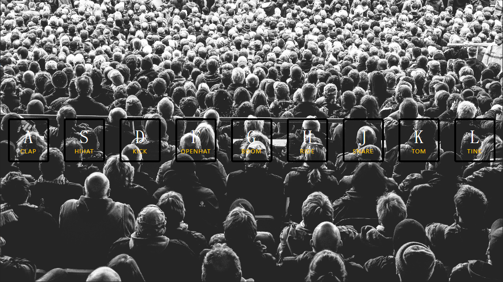
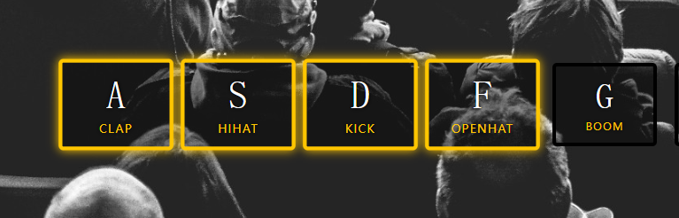

# js30-1-drum-kit

## reference

https://github.com/wesbos/JavaScript30/tree/master/01%20-%20JavaScript%20Drum%20Kit

官方提供的参考代码中，在按键触发时增加动画类，在动画结束事件 `transitionend` 触发时移除动画类。如果长按某个按键的话，该事件就失效了。无法移除动画类

